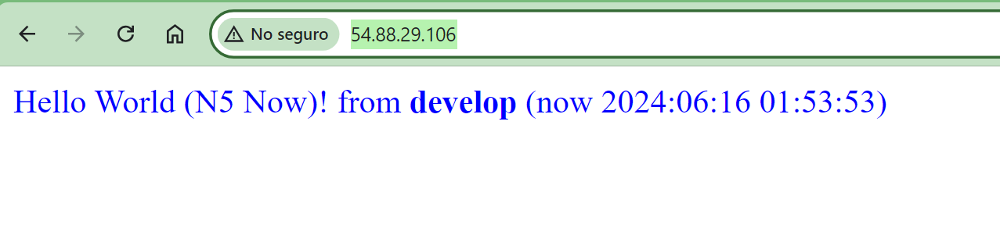

# Challenge DevOps N5 Now

## **CI/CD**

### **Job - buildImage**

* En esta fase se construye la imagen y se guarda en el servicio Amazon Elastic Container Registry

### **Job - deploy**

* En esta fase se despliega la aplicaciòn en Amazon Elastic Container Service.
* Se agrega un paso adicional donde termina una task para poder liberar el container.

## **PRUEBAS**

* Se evidencia la ejecución de los workflows en GitHub
* Se evidencia los eventos en AWS ECS

### Al momento de lanzar el workflow desde el branch **develop**

### Al momento de lanzar el workflow desde el branch **testing**

## **INFRAESTRUCTURA**

* Mencionar que la infraesctructura se creó por IaC mediante Terraform.

## **REFERENCIAS**

* https://docs.github.com/en/actions/deployment/deploying-to-your-cloud-provider/deploying-to-amazon-elastic-container-service
* https://github.com/aws-actions/amazon-ecr-login
* https://github.com/aws-actions/amazon-ecs-render-task-definition
* https://github.com/aws-actions/amazon-ecs-deploy-task-definition